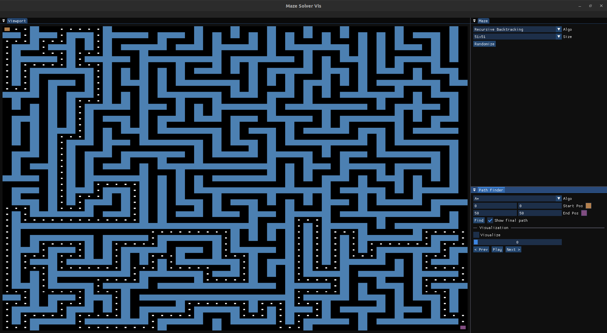
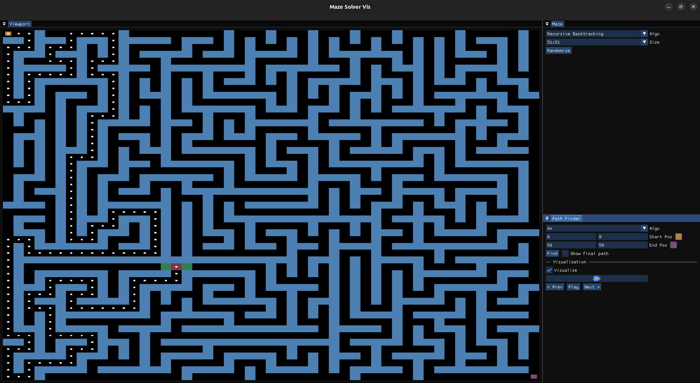

# Maze Solver Visualization

## Project Overview

This is an Maze Solver Visualization application developed in C++ using OpenGL 4.6. The project demonstrates maze generation and pathfinding algorithms with real-time rendering.

### Features

- Multiple Maze Generation Algorithms:
  - Recursive Backtracking
  - Kruskal's Algorithm
  - Prim's Algorithm 

- Pathfinding Algorithms:
  - Breadth-First Search (BFS)
  - Depth-First Search (DFS)
  - A* Search Algorithm

- Visualization
- Dynamic Grid Sizing

## Screenshots

### Screenshot 1


### Screenshot 2


### Screencast 1
[](screenshots/Screencast1.webm)

## Prerequisites

### Tested Configurations
- **OS**: Ubuntu 22.04.4 LTS
- **Processor**: Intel Core i7
- **Graphics**: NVIDIA Corporation GP108M [GeForce MX230]
- **CMake**: v3.22.1
- **GCC**: v13.2.0
- **GLFW**: v3.3.6
- **GLM**: v0.9.9.8

### Release Information
- **Current Release Version**: v1.0.0
- **Supported Platform**: x64 Linux

### Build Dependencies
- C++17 Compiler (GCC 9.0+ / Clang 8.0+ / MSVC 19.20+)
- CMake (3.12 or later)
- OpenGL 4.6
- GLFW 3.3+
- GLM Library

### System Requirements
- Windows 10/11, macOS 10.15+, or Linux (Ubuntu 20.04+)
- Dedicated Graphics Card recommended
- Minimum 4GB RAM
- 500MB Disk Space

## Installation

### Linux (Ubuntu/Debian)
```bash
# Update package list
sudo apt update

# Install dependencies
sudo apt-get install cmake libglfw3-dev libglm-dev

# Clone the repository
git clone --recursive https://github.com/Htrap19/MazeSolverAssignment.git

# Navigate to project directory
cd MazeSolverAssignment

# Create build directory
mkdir build && cd build

# Configure with CMake
cmake ..

# Build the project
make
```

### macOS (using Homebrew)
```bash
# Install dependencies
brew install cmake glfw glm

# Clone repository
git clone https://github.com/Htrap19/MazeSolverAssignment.git

# Build steps similar to Linux
```

### Windows (Visual Studio)
1. Install Visual Studio 2019/2022 with C++ Desktop Development
2. Install vcpkg
3. Use vcpkg to install dependencies:
   ```
   vcpkg install glfw3 glm
   ```
4. Open project with CMake support in Visual Studio

## Project Structure
```
│
├── CMakeLists.txt             # Build configuration
├── src/                       # Source files
│   ├── main.cpp
│   ├── renderer.cpp
│   ├── renderer.h
│   ├── shader.cpp
│   ├── shader.h
│   ├── maze.cpp
│   ├── maze.h
│   ├── pathfinder.cpp
│   ├── pathfinder.h
│   ├── application.cpp
│   ├── application.h
│   ├── mazevisualizerapp.cpp
│   ├── mazevisualizerapp.h
│   ├── recursivebacktrackingmaze.cpp
│   ├── recursivebacktrackingmaze.h
│   ├── kruskalmaze.cpp
│   ├── kruskalmaze.h
│   ├── primmaze.cpp
│   ├── primmaze.h
│   ├── astarpathfinder.cpp
│   ├── astarpathfinder.h
│   ├── bfspathfinder.cpp
│   ├── bfspathfinder.h
│   ├── dfspathfinder.cpp
│   └── dfspathfinder.h
│
├── resources/shaders          # Shaders
│   └── vertex.glsl
│   └── fragment.glsl
│
└── vendor/                    # Third-party libraries
    └── imgui/
```

## Future Enhancements
- Interactive Maze Drawing
- Performance Metrics Display
- Additional Maze Generation Algorithms

## Contact

**Project Maintainer**: [Parth Lodhia](https://www.linkedin.com/in/parth-lodhia-a284a020b/)
- Email: parthlodhia154@gmail.com
- GitHub: @Htrap19

---

**Note**: Screenshots and detailed documentation coming soon!
